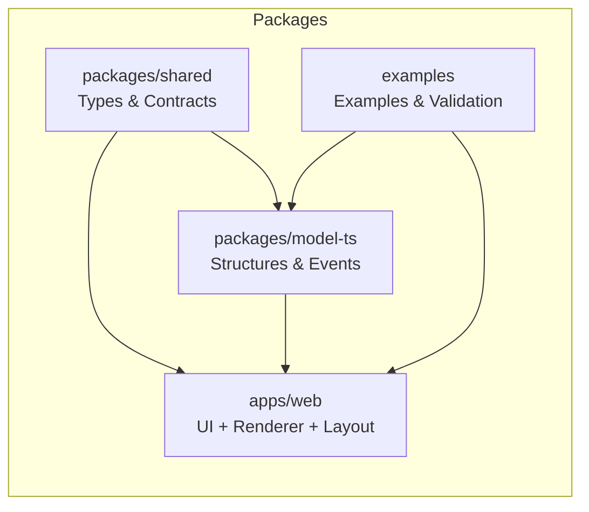
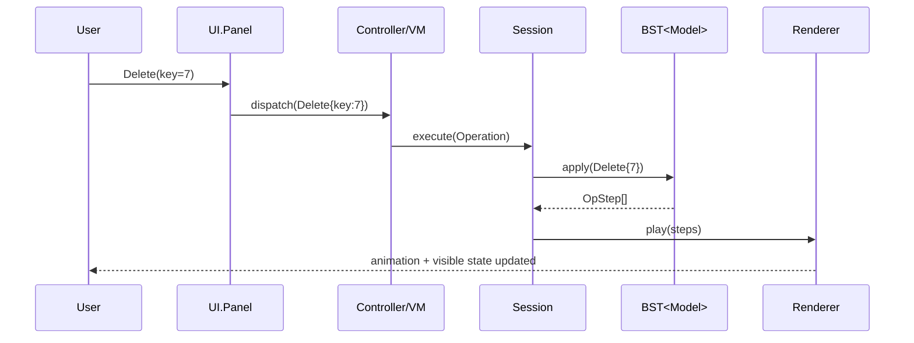
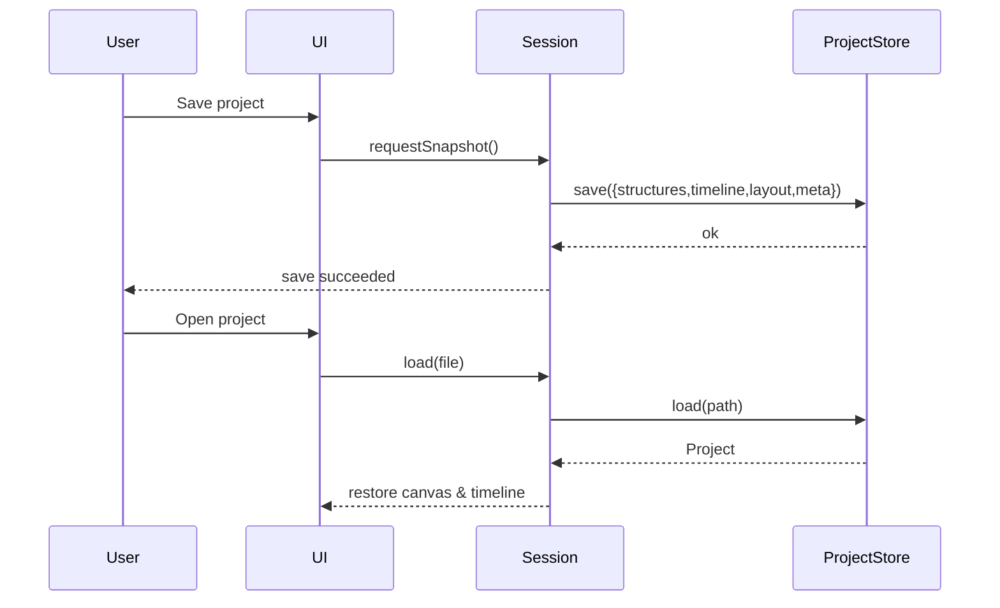
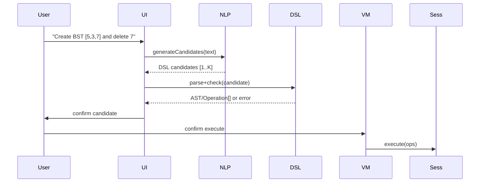
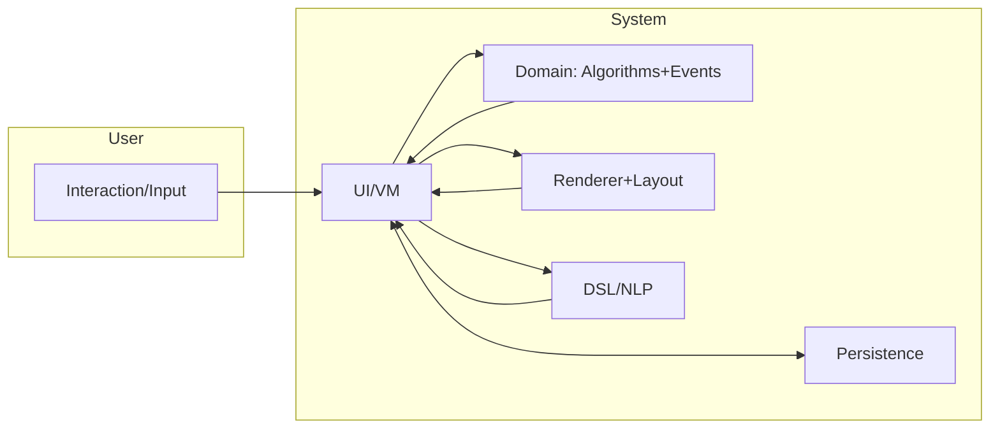
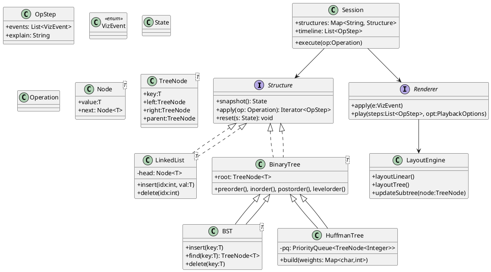
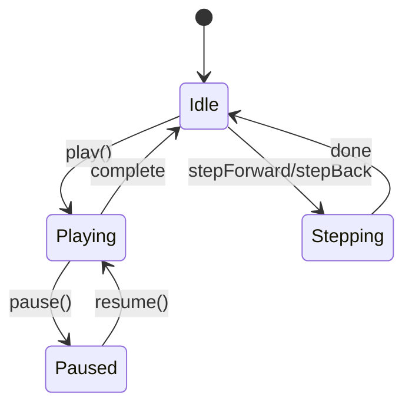

````markdown
# LT-Vis System Architecture and Module Interaction Design (DESIGN.md)

This design document builds on REQUEST.md (requirements and design) and provides an implementable system architecture, module interactions, key interfaces, data flows, state machines, and main timing sequences. Goal: support the minimum viable prototype (MVP) for the second review and leave clear extension points for DSL, NL→DSL, AVL, etc.

- Reference: REQUEST.md (Sections 6–20)
- Terminology: Structure / Operation / OpStep / VizEvent / StateSnapshot
- Conventions: Mermaid diagrams are primary; PlantUML used for class/sequence diagrams where appropriate.

---

## 1. Overall Architecture (layers and boundaries)

```mermaid
flowchart TB
  subgraph UI[Presentation Layer (UI)]
    Panel[Tool Panel / Properties]
    TimelineCtrl[Timeline Control]
    Canvas[Canvas]
  end
  subgraph VM[ViewModel / Controller]
    CmdBus[Command Bus]
    Session[Session / Scenario Manager]
  end
  subgraph Domain[Domain Layer]
    Algo[Core.Algorithms]
    Events[Core.Events]
  end
  subgraph Viz[Visualization Layer]
    Engine[Viz.Engine]
    Layout[Viz.Layout]
    Animator[Animation Scheduler]
  end
  subgraph Infra[Infrastructure]
    IO[IO.Persistence]
    DSL[Lang.DSL]
    NLP[AI.NLP]
    CFG[Config / Logging / Theme]
  end

  Panel --> CmdBus
  TimelineCtrl --> CmdBus
  CmdBus --> Session
  Session --> Algo
  Session --> Events
  Session --> Engine
  Engine --> Layout
  Engine --> Animator
  Session --> IO
  DSL --> Session
  NLP --> DSL
  CFG --> UI
  CFG --> Engine
```

Design points
- UI does not depend on concrete data structure classes; it dispatches Operations via VM/Session and consumes replay state.
- Model (Algorithms + Events) is rendering-agnostic and only produces OpStep/VizEvent.
- Viz.Engine consumes VizEvent and maintains visible state; Layout computes coordinates independently.
- IO handles project persistence; DSL/NLP are optional input sources.

---

## 2. Core contracts and shared types (aligns with REQUEST.md 8.1)

Key interfaces (summary):
- Structure: kind, id, snapshot(): StateSnapshot, reset(), apply(op): Iterable<OpStep>
- Operation: Create (requires id), Insert/Delete/Find/Traverse/Attach/Push/Pop/BuildHuffman — all non-Create operations require `target: structureId`
- OpStep: events: VizEvent[], explain?, snapshot? (v1: present on every step), error?
- VizEvent: CreateNode/RemoveNode/Link/Unlink/Move/Highlight/Compare/Swap/Rotate/Rebalance/Tip (discriminated union)
- StateSnapshot: nodes[], edges[], meta

Default event execution order: Highlight/Compare → Create/Remove/Link/Unlink → Move/Rotate/Rebalance → Tip/Explain

ID convention: structure ids are stable tokens (e.g., `BST1`, `ListA`); node ids include the structure prefix `<StructId>:n<index|key>`, edge ids `<src>-><dst>[:<label>]`. DSL `target` resolves to structure ids only.
Suggested aliases (shared types): `type StructureID = string; type NodeID = ID;` to reduce misuse between structure ids and node ids.

---

## 3. Component view (Mermaid components)



Notes:
- `packages/shared`: single source of truth for types/schema
- `packages/model-ts`: SeqList/LinkedList/Stack/BinaryTree/BST/Huffman + Operation→OpStep
- `apps/web`: React UI + Viz.Engine + LayoutEngine
- `examples`: structured examples and validation scripts

---

## 4. Main sequence flows

### 4.1 Execute one BST delete



Acceptance points:
- Search path highlighting, successor/predecessor identification, value replacement/node removal, and subtree shrink animation are visible.
- Timeline can pause/rollback; stepBack uses snapshots or inverse events if available.

### 4.2 Save / Open project



### 4.3 Natural Language → DSL → Execute (extension)



---

## 5. Data flow diagram (DFD)



Inputs: buttons/forms/DSL/NL/import files
Outputs: canvas animations, explanation text, exported images/project files
Persistence: structures, timeline, layout cache, user preferences, metadata

---

## 6. Class diagram (core model, PlantUML)



Alignment notes: interfaces match `packages/shared` TypeScript contracts; implementations may use generics or concrete classes.

---

## 7. Timeline & playback control (state machine)



Notes:
- stepBack policy (v1.0): every OpStep includes `snapshot`; Renderer uses snapshot-first reversal and may attempt inverse events only as an optimization.
- setSpeed affects animation speed only, not event order.
- Session/Model apply contract: `apply(op)` should compute on a working copy, emit the full OpStep[] (with snapshots) after validation, and commit internal state only if no error OpStep is produced; avoid mutating state incrementally while streaming steps.

---

## 8. Layout engine (API summary)

- `layoutLinear(nodes, {direction,gap,start})`
- `layoutTree(nodes, edges, {root,layerGap,siblingGap,align})`
- `updateSubtree(rootId, nodes, edges)`
- `supportsPinning()`

Implementation suggestions: d3-hierarchy (Reingold‑Tilford) or elkjs; prioritize stable layouts and local rearrangement.

---

## 9. Persistence schema (summary)

```json
{
  "meta": { "version": "1.0.0", "created_at": "..." },
  "structures": [{ "id": "BST", "kind": "BST", "state": { /* SnapshotJSON */ } }],
  "timeline": [ { "step":0, "events": [ /* VizEvent[] */ ], "explain": "...", "snapshot": { /* SnapshotJSON */ } } ],
  "layout": { "nodes": { "BST:n5": {"x":123, "y":456} } }
}
```

Timeline persistence rule mirrors REQUEST: include `snapshot` per step to guarantee reversible `stepBack` in demos and tests.

---

## 10. Implementation roadmap and assignment (aligned to milestones)

- Sprint A (pre-M2): Model (LinkedList/BST) + Events output; examples runnable
- Sprint B (M2): Renderer/Timeline MVP; linear and tree layouts
- Sprint C (M3): Huffman + save/open + export; E2E tests
- Sprint D (M4 optional): DSL + NL→DSL + AVL; performance tuning

Each sprint ends with a runnable demo, unit test report, and 30–60s screencast.

---

## 11. Non-functional guarantees

- Performance: n ≤ 50 maintain ≥ 30 FPS; Operation→OpStep 95th < 200ms
- Usability: critical path ≤ 3 clicks; keyboard shortcuts for play/pause/step
- Reliability: autosave draft; rollback consistency ≥ 99%
- Maintainability: model layer coverage ≥ 90%; shared types contract enforcement

---

## 12. Appendix: TS interface mapping

Shared `packages/shared/types.ts` is authoritative. Ensure:
- event idempotence, stable IDs, and visible error OpSteps
- event execution order and animation timing per Section 2

---

If helpful, I can proceed to:
- scaffold `packages/shared` type templates
- add a minimal `apps/web` sample Renderer + Timeline
- create a Chevrotain DSL parsing demo

````
