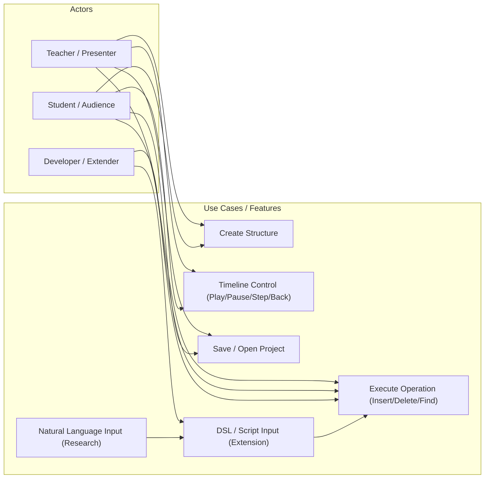
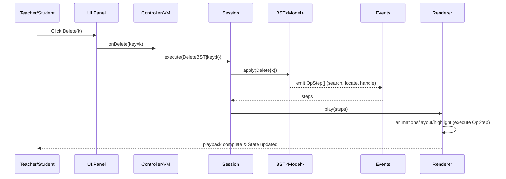
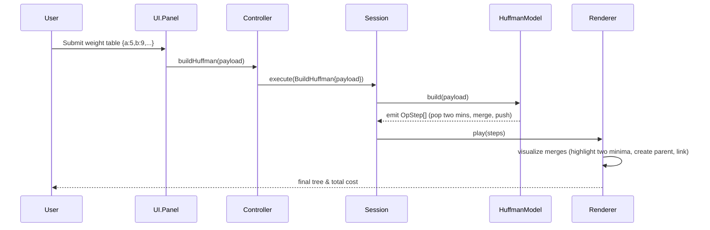

````markdown
# 1. Project Overview

* **Project Name**: Linear & Tree Data Structure Visualizer (LT-Vis)
* **One-line Goal**: Visualize algorithmic steps of data structures (pointer updates, node replacement, rotations, merges, etc.) with interactive animations and a replayable timeline to support classroom demonstrations and student self-study.
* **Scope (v1.0 / this phase)**: Implement essential features required by the course:
  - Dynamic demonstrations of list construction, insertion, and deletion for linear lists (array-based and singly linked lists);
  - Stack (array-based) push/pop demonstration;
  - Construction, search, and deletion (including the three deletion cases) for binary trees (pointer-based) and binary search trees (BST);
  - Construction process for Huffman trees (priority-queue merging);
  - Basic visualization capabilities: stable tree/linear layouts, node/edge rendering, playback controls (play/pause/step forward/step back/speed), basic interactions (select/drag/zoom/canvas pan).
  - Preserve program extensibility.
* **Extension points (later versions)**: project save/open (session persistence), AVL/self-balancing tree rotation visualization, DSL script driving, natural language → DSL (LLM-assisted), etc.

---

# 2. Terminology and Definitions (Formalization)

The following terms are used for team communication and acceptance criteria and are aligned to the engineering data shapes.

* **State**: A complete description of a structure at any point in time, including: node set (id, value, visualProps), edge set (srcId, dstId, label, visualProps), layout information (node coordinates), and metadata (activeSelection, stepIndex).
  - Formal example (JSON fragment):
```json
{
  "nodes": [
    {"id":"n1","value":5,"x":120,"y":40},
    {"id":"n2","value":7,"x":220,"y":120}
  ],
  "edges": [{"src":"n1","dst":"n2","label":"left"}],
  "meta": {"step":3}
}
```

* **Operation**: A semantic request against a data structure (e.g., Insert(key), Delete(key), Push(value)), executed by the Model layer and returning one or more ordered OpStep items.

* **VizEvent**: A set of instructions consumable by the Renderer. Common event types: CreateNode(id,payload), RemoveNode(id), Link(src,dst,label), Unlink(src,dst), Move(id,x,y), Highlight(id,style), Rotate(type,pivot), Tip(text,anchor). Events should be idempotent and serializable.

* **Timeline**: A replayable structure organized by a sequence of OpStep items, supporting: play/pause/stepForward/stepBack/setSpeed/jumpTo(index). The timeline records either State snapshots or reversible events for each index to ensure reproducible backward navigation.

* **DSL (Domain Specific Language)**: A lightweight scripting language (v0.1 grammar draft appears later) for declaring structures and action sequences. DSL is an optional entry point in v1.0; the parser is an independent module.

---

# 3. Goals and Value

Teaching value (why deliver)
- Visualize abstract operations (e.g., pointer reconnection, node replacement, tree rotation) with animations and annotations so students can understand BST deletion's three cases within 5 minutes (verification: classroom demo video + student questionnaire).

Engineering deliverables (what to produce)
- Decouple the Model layer (Structure/Operation/OpStep/VizEvent) from the Renderer layer and deliver at least one reusable set of type definitions and unit tests (Model layer unit-test coverage target ≥ 80%).

Research/extension value
- Enable future natural language → DSL research by exposing data channels: record raw DSL input, generated Operation lists, and final timelines for alignment evaluation.

Measurable acceptance criteria
1. Documentation: `REQUEST.md` fully explains project overview, terminology and definitions, goals/value, and main users/scenarios (this update covers the first three items; remaining items to be completed later).
2. Interface contract draft (minimum): list the four Model-layer types (Structure, Operation, OpStep, VizEvent) with brief field descriptions, sufficient for a developer to implement the replay pipeline in 1–2 pages.
3. Verification examples: provide two reproducible minimal examples — linked list insertion ([1,3,4] insert 2 at index 1) and BST deletion (build [5,3,7,2,4,6,8], delete 7) — and describe the OpStep sequence and expected visual result for each step (descriptive is sufficient).
> Example file locations (quick references): reproducible examples are in the repository `examples/`:
  - `examples/types.ts` — TypeScript type definitions (State/OpStep/VizEvent)
  - `examples/linkedList_insert_example.ts` — linked list insertion example ([1,3,4] insert 2 at index 1)
  - `examples/bst_delete_example.ts` — BST deletion example (build [5,3,7,2,4,6,8] and delete 7)
  Reviewers can reference or run these examples to validate timelines and event sequences.

Short contract (engineering mini-contract)
- Input: structure initialization data or operation sequences provided by user or script (JSON / DSL / UI form).
- Output: an ordered sequence of OpStep items (including VizEvents) and final State (serializable to JSON); Operation.target always refers to a concrete structure id that was introduced via a Create Operation.
- Success criteria: given an input, the system generates a non-empty OpStep sequence; the Renderer can accurately reproduce each OpStep's visual changes in stepwise playback.
  - Error mode: illegal operations (out-of-bounds insert, delete non-existent key) should return a displayable error OpStep (with explain field) and preserve timeline rollback.

Major boundaries / edge cases (engineering notes)
- Operations on empty structures (delete on empty list, pop on empty stack)
- Duplicate key/value insertion (BST duplicate-key policy must be defined)
- Layout overflow (visual overlap when too many nodes; v1 limits n ≤ 50 and shows degradation hints)
- DSL parsing errors (should return friendly errors and provide corrective hints)


---

# 4. Users and Usage Scenarios

This section refines user personas into measurable roles and supplements each core scenario with preconditions/postconditions and acceptance checkpoints (useful for initial demonstration evaluation).

## 4.1 Personas

1. Student / Self-learner
  - Goal: quickly grasp algorithm steps and pointer/node changes; record homework and replay.
  - Skills: CS fundamentals (arrays/pointers), comfortable with interactive UIs.
  - Acceptance: complete a single demonstration of linked list insertion or BST search within 5 minutes, with stepwise explanations and timeline visible.

2. Teacher / Teaching Assistant (Presenter)
  - Goal: controlably demonstrate algorithm steps in class, pause to explain key steps, and save demonstrations as homework samples.
  - Skills: familiar with teaching scenarios; needs quick switching between examples and reliable playback controls.
  - Acceptance: import a dataset and demonstrate BST deletion (one of the three cases), export a screenshot or save the project; playback should be smooth and reversible.

3. Developer / Extender
  - Goal: add new structures or algorithms with low integration cost, reusing the Model layer and implementing only event-generation logic.
  - Skills: familiar with TypeScript/Python (implementation path dependent), able to read interface contracts.
  - Acceptance: implement a minimal `Structure` using `packages/shared/types.ts` interfaces and observe OpStep output in `examples`.


## 4.2 Core Scenarios (Stories with preconditions/postconditions and acceptance)

Scenario A — Classroom Demonstration: BST Deletion (Instructor)
- Preconditions: data `[5,3,7,2,4,6,8]` loaded and layout completed.
- User action: instructor clicks "build BST", selects "delete", inputs `7`, then steps through the timeline, pausing on key steps to explain.
- System action: Model emits OpStep sequence → Renderer plays events (Highlight/Swap/Unlink/RemoveNode/Move) → timeline index and State update.
- Postcondition: final tree preserves BST properties; instructor can export the current canvas as PNG and save the project.
- Acceptance: each step presents corresponding explanatory text; play/pause/step/jump work; operation generation delay per step ≤ 200ms p95 on an 8-core / 16GB dev laptop (generation only, excluding render).

Scenario B — Student Self-test: Linked List Insert (Student)
- Preconditions: new empty list or loaded `[1,3,4]`.
- User action: in UI select List → Insert → provide position `1` and value `2` → click execute.
- System action: Model outputs OpStep sequence: Highlight(target), CreateNode(nNew), Link(nNew->n2), Unlink(n1->n2), Link(n1->nNew), Move(layout) etc.
- Postcondition: canvas displays `[1,2,3,4]`, timeline records 5 OpSteps, student can replay or export step descriptions.
- Acceptance: each OpStep includes events and explain; final State nodes/edges match expectation; student completes operation within three clicks.

Scenario C — Session Save & Replay (save/open)
- Preconditions: user completes operations and selects "save session".
- User action: click "save project", fill metadata, save local JSON.
- System action: serialize `structures, timeline, layout, meta` into a project file; later load restores timeline index.
- Acceptance: re-opening the saved project restores node coordinates, timeline steps, and explain texts.

Scenario D — Huffman Construction Visualization (Student/Instructor)
- Preconditions: weight table provided.
- User action: click "build Huffman" → system visualizes the merge process, highlighting the two minimum nodes each round → merging into the heap until root forms.
- Acceptance: merge order is reproducible; final encoding tree matches reference minimal cost.

Scenario E — Natural Language (Extension)
- Preconditions: system offers an NL→DSL candidate parsing interface (prompt/confirm mode).
- User action: input natural language "create BST [5,3,7,2,4] and delete 7", system proposes DSL candidates and asks for confirmation before execution.
- Acceptance: after confirmation the system generates Operation[] and replays OpStep; on parser failure provide an editable DSL candidate.


# 5. Functional Requirements (Use Cases + Priority & Acceptance)

Using MoSCoW prioritization; for each "Must (M)" function include a simple acceptance test.

## 5.1 Core Features (Course required, M) - with acceptance tests

M-01 Linear lists (array/linked) construction, insert, delete dynamic demonstration
- Acceptance: `examples/linkedList_insert_example.ts` can be parsed into initialState + steps; Renderer can replay to show final State `[1,2,3,4]`.

M-02 Stack (array) push/pop demonstration
- Acceptance: create stack, push 1,2,3, pop twice; timeline records CreateNode/RemoveNode events; top indicator is correct.

M-03 Binary tree (pointer-based) construction and traversal (pre/in/post/level) visualization
- Acceptance: construct tree from sequence, choose traversal (via `Traverse` Operation), and each step highlights the current node with explain text; timeline records per-step snapshots to support stepBack (e.g., preorder of `[2,1,3]` highlights 2→1→3).

M-04 BST construction, search, deletion (all three deletion cases) visualization
- Acceptance: use `examples/bst_delete_example.ts` to verify deletion of node with two children; replay must show search path, successor/predecessor highlighting, replacement, and deletion.

M-05 Huffman tree construction demonstration (min-heap / priority queue + merging)
- Acceptance: for `{a:5,b:9,c:12,d:13,e:16,f:45}`, show merge order and final tree; total cost matches reference algorithm.

M-06 Robust layouts (avoid overlap, consistent direction, adjustable spacing)
- Acceptance: auto-layout on n=15 tree produces non-overlapping nodes with adjustable layer spacing; degrade mode for n>50.

M-07 Playback controls (play/pause/step forward/step back/jump/speed)
- Acceptance: pause halts Renderer; stepBack restores previous visual snapshot using the per-step snapshot recorded in the timeline.

M-08 GUI interactions (panels, buttons, drag, zoom, canvas pan)
- Acceptance: drag node to adjust position and lock it; zoom and pan perform within three interactions.

M-09 MVC/MVVM architecture, separation of core logic and UI
- Acceptance: with Renderer disabled, Model layer still generates OpStep and serializes to JSON.

## 5.2 Extension Features (S/C, prioritized)

S-10 Project save/open/continue editing (timeline included) — recommended for v1.1
S-11 AVL construction and rotation visualization (LL/RR/LR/RL) — v1.2
S-12 Script-driven rendering (DSL/scripts) — coordinate with DSL parser development
C-13 LLM natural language to DSL parsing & execution — research scope (data collection & safety review)
C-14 Themes/export images/videos/GIFs — UX polish & export toolchain

## 5.3 Non-functional Requirements (quantified)

* Performance: for n ≤ 50, Renderer maintains ≥ 30 FPS; Model layer Operation→OpStep latency p95 < 200ms on an 8-core / 16GB dev laptop (n ≤ 50, warm cache).
* Usability: common operations (build/execute/play/save) ≤ 3 clicks; keyboard shortcuts for key controls.
* Extensibility: new Structure plugin must implement `Structure` interface and provide unit tests; Renderer contract only depends on `OpStep`/`VizEvent`.
* Portability: prioritize Web (React + Vite) with optional Tauri packaging for desktop.
* Reliability: implement autosave (every 30s or 5s after an operation) and prompt for recovery after restart.

## 5.4 Model ↔ Renderer separation (enforced contract)
- Model emits topology-only snapshots (ids, values/labels, props, edges, meta) and logical OpSteps (Highlight/Compare/Link/Unlink/Create/Remove/Tip/Rotate/Rebalance/Error) with per-step snapshots; do **not** include positions for non-pinned nodes.
- Renderer/layout owns positions/animations: recompute layout per step from topology; animate transitions internally; UI renders renderer state only.
- Operations must Create structures before other ops; timeline/playback must consume all OpSteps in order, using per-step snapshots for stepBack.
- Errors must not advance visible state; keep prior view intact on error OpSteps.

---

# 6. Use Case Diagram

**Textual use-case relationships**

- Instructor/Student ⇄ {Create Structure}{Execute Operation}{Control Playback}{Save/Open Project}
- Student ⇄ {Edit Data}{Step/Back Inspect}{Export Screenshot/Video}
- Extension: User ⇄ {DSL Input}{NL Input} → {Parse to Operation} → {Replay}



---

# 7. Interaction Flows

This section uses Mermaid sequence diagrams to describe two core interaction flows: BST deletion and Huffman construction. Each flow includes acceptance checkpoints for verification.

## 7.1 BST Deletion (sequence)



Acceptance points (BST deletion)

- The system shows the search path (highlighted nodes) and presents the corresponding strategy at the deletion case (direct delete / replace with child / replace with successor).
- The timeline can pause at any OpStep and show explain text; stepBack restores the previous visual state or snapshot.

## 7.2 Huffman Construction (sequence)



Acceptance points (Huffman construction)

- Animation shows selection of two minimum nodes and merging each round; final cost equals reference implementation.
- Timeline can replay merge steps and optionally display heap snapshots.

## 7.3 General interaction checklist (for first demo)

1. Import example data via UI and build structures (build should call Model.apply()).
2. Timeline: play/pause/stepForward/stepBack/setSpeed work; stepBack uses the per-step snapshots emitted by Model (inverse events optional optimizations only).
3. Each OpStep includes explain text visible in a side panel; key events (Link/Unlink/Swap/Rotate) use prominent visual styles.
4. Export: current canvas export to PNG or save project as JSON (structures + timeline + layout + meta).

---

# 8. Data Model (Model Layer Abstractions)

This section is a core deliverable for the first course inspection: strict type contracts, internal representations, invariants, mapping rules from Operation → OpStep → VizEvent, error handling, and complexity notes. The TypeScript contracts below align with `packages/shared/types.ts`.

## 8.1 Common interfaces (TypeScript contract)

```ts
// Identifiers and state snapshot
export type ID = string; // convention: <StructKey>:<LocalId>, e.g. "L:n3", "BST:r.left"
// Suggested aliases to avoid ambiguity in code: type StructureID = string; type NodeID = ID;

export interface NodeState {
  id: ID;
  label?: string;        // UI text (index/key)
  value?: number | string; // semantic value (may mirror label)
  x?: number; y?: number; // coordinates (written by layout engine)
  pinned?: boolean;      // pinned position
  props?: Record<string, unknown>; // visual or structural extras
}

export interface EdgeState {
  id: ID;                // convention: src->dst or with suffix, e.g. "n1->n2:left"
  src: ID; dst: ID;
  label?: string;        // e.g. "left" | "right" | "next"
  props?: Record<string, unknown>;
}

export interface StateSnapshot {
  nodes: NodeState[];
  edges: EdgeState[];
  meta?: {
    step?: number;
    selection?: ID | null;
    [k: string]: unknown;
  };
}

export type VizEvent =
  | { type: 'CreateNode'; node: NodeState }
  | { type: 'RemoveNode'; id: ID }
  | { type: 'Link'; edge: EdgeState }
  | { type: 'Unlink'; id?: ID; src?: ID; dst?: ID }
  | { type: 'Move'; id: ID; x: number; y: number }
  | { type: 'Highlight'; target: { kind: 'node' | 'edge'; id: ID }; style?: Record<string, unknown> | string }
  | { type: 'Compare'; a: ID; b: ID }
  | { type: 'Swap'; a: ID; b: ID }
  | { type: 'Rotate'; kind: 'LL' | 'RR' | 'LR' | 'RL'; pivot: ID; info?: Record<string, unknown> }
  | { type: 'Rebalance'; info?: Record<string, unknown> }
  | { type: 'Tip'; text: string; anchor?: ID };

export interface OpStep {
  events: VizEvent[];
  explain?: string;
  snapshot?: Partial<StateSnapshot>; // v1 policy: provided on every OpStep for timeline reversal
  error?: { code: string; message: string }; // if present, this step is an error stop
}

export type Operation =
  | { kind: 'Create'; id: ID; structure: 'SeqList' | 'LinkedList' | 'Stack' | 'BinaryTree' | 'BST' | 'Huffman'; payload?: unknown }
  | { kind: 'Insert'; target: ID; pos?: number; value?: number | string }
  | { kind: 'Delete'; target: ID; key?: number | string; pos?: number }
  | { kind: 'Find'; target: ID; key: number | string }
  | { kind: 'Traverse'; target: ID; order: 'preorder' | 'inorder' | 'postorder' | 'levelorder' }
  | { kind: 'Attach'; target: ID; parent: ID; child: ID; side: 'left' | 'right' }
  | { kind: 'Push'; target: ID; value: number | string }
  | { kind: 'Pop'; target: ID }
  | { kind: 'BuildHuffman'; target: ID; weights: Record<string, number> };

export interface Structure {
  kind: 'SeqList' | 'LinkedList' | 'Stack' | 'BinaryTree' | 'BST' | 'Huffman';
  id: ID; // structure identifier (for ID namespace)
  snapshot(): StateSnapshot;                   // export current state (serializable)
  reset(state: StateSnapshot): void;           // restore from state (rollback/open)
  apply(op: Operation): Iterable<OpStep>;      // input Operation, output visual steps
}
```

Conventions and notes
- ID format: use a structure-specific namespace (e.g., `L:n0`, `BST:n7`); edges use `src->dst[:label]`.
- Event idempotence: Renderer may reapply the same OpStep.events without corrupting state (for replay and rollback).
- Error presentation: if OpStep.error exists, halt the current apply(); the explain field should be user-visible.
- Structure registration: every Create operation must provide a unique structure `id`; all subsequent Operations reference `target: ID` that matches a registered structure id (never a type keyword).
- ID domains: structure ids are stable tokens without the node prefix (e.g., `BST1`, `ListA`); node/edge ids are qualified with structure prefix (`BST1:n7`, `BST1:n5->BST1:n7:right`). DSL `target` resolves to the structure id; the Model is responsible for namespacing node/edge ids using that structure id.

## 8.2 Structure definitions (internal representation, invariants, mapping rules)

For each structure: internal memory model, invariants, supported operations and mapping rules from Operation to VizEvent sequence.

### 8.2.1 SeqList<T>

- Internal: `values: T[]`
- Invariants:
  - length `n = values.length`, indices in `[0, n)`;
  - snapshot `nodes` ordered by index with `label = String(index)`.
- Operations:
  - `insert(pos: number, value: T)` — error if `pos ∉ [0,n]`;
  - `delete(pos: number)` — error if `pos ∉ [0,n-1]`.
- Event mapping:
  - Insert: Highlight(pos) → for i ∈ [pos, n-1] emit Move (shift right) → CreateNode (new element) → Tip("insert at pos");
  - Delete: Highlight(pos) → RemoveNode(target) → for i ∈ (pos, n-1] emit Move (shift left).

ID/coordinate convention: `A:i`; linear layout on a horizontal grid.

### 8.2.2 LinkedList<T>

- Internal: `Node { id: ID, val: T, next?: Node, prev?: Node }`, `head?: Node`.
- Invariants:
  - acyclic; head reaches all nodes;
  - for doubly-linked lists, `prev.next === self && next.prev === self`.
- Operations:
  - `insertAt(pos: number, value: T)` (allow pos = length)
  - `deleteAt(pos: number)`
- Event mapping:
  - Insert: Highlight(prev) → CreateNode(nNew) → Unlink(prev->oldNext) → Link(prev->nNew) → Link(nNew->oldNext) → Move(local layout) → Tip(finish);
  - Delete: Highlight(target and prev) → Unlink(prev->target) → Link(prev->target.next) → RemoveNode(target) → Move(local shrink).

Edge label = 'next' (prev can be modeled via props or omitted).

### 8.2.3 Stack<T>

- Internal: `arr: T[]`, `top = arr.length - 1`.
- Invariants: top points to stack top; snapshot includes a top indicator node/style.
- Operations: `push(value: T)`, `pop()` (error on empty).
- Event mapping:
  - Push: CreateNode(n) → Highlight(n) → Move(n to top position) → update top indicator (Tip or style)
  - Pop: Highlight(top) → RemoveNode(top) → top indicator moves down.

### 8.2.4 BinaryTree<T>

- Internal: `TreeNode { id: ID, key: T, left?: ID, right?: ID, parent?: ID }`, `root?: ID`.
- Invariants: acyclic, parent/child references consistent.
- Operations: attach(parent, child, side:'left'|'right'), traversals (Highlight-only). Both map to Operation variants: `Attach` and `Traverse`.
- Event mapping: CreateNode(child) → Link(parent->child,label=side) → Move(local/global layout); traversals: Highlight(node) on visit.
- Attach semantics: `Attach` links an existing node id under the given parent/side; creating new nodes still uses `CreateNode` events in OpSteps produced by `Attach` if the child node is not yet present.
- Acceptance hint: preorder `[2,1,3]` highlights 2→1→3 with per-step snapshots; attaching `child` under `parent` emits CreateNode (if needed) + Link + Move + snapshot.

### 8.2.5 BST<T extends Comparable>

- Invariant: for all nodes, left subtree < node.key < right subtree; v1 rejects duplicate keys (error `E_KEY_DUP`).
- Operations: insert(key), find(key), delete(key) (three deletion cases: leaf, single child, two children → successor replacement); traversal delegates to `Traverse` if needed.
- Event mapping:
  - Insert: highlight path, CreateNode & Link at position, Move (stable layout);
  - Find: highlight path sequentially; Tip("Found") or Tip("Not Found");
  - Delete (two-child): Highlight(search path) → Highlight(successor) → Swap(target, successor) or Tip("value replace") → Unlink(successor parent->successor) → RemoveNode(successor) → Move(subtree shrink).
  - Traverse: same semantics as BinaryTree traverse; emit Highlight per visit with explain text.

### 8.2.6 Huffman

- Internal: min-heap `PQ<TreeNode>` + forest; node weight stored in `NodeState.props.weight`.
- Invariants: parent.weight = sum(children.weight); heap property holds; iterate until single root.
- Operation: build(weights: Record<string, number>).
- Event mapping per round: Highlight(two minima in heap) → CreateNode(parent{weight=sum}) → Link(parent->a,'0'), Link(parent->b,'1') → optionally remove a/b from heap visually → Move(tree layout).

ID/labels: leaf label = character; edge label = '0'|'1'.

### 8.2.7 ID and labeling conventions

- Structure prefix namespace `<StructKey>` (e.g., `L`/`LL`/`STK`/`BST`/`HF`).
- Node IDs: `<StructKey>:n<index|key>`, e.g., `BST:n7`.
- Edge IDs: `<src>-><dst>[:<label>]`, e.g., `BST:n7->BST:n8:right`.

## 8.3 Snapshots and serialization (minimal schema)

Snapshots are used for rollback/replay and project save/load (see Section 10). Minimal schema:

```ts
type JSONValue = string | number | boolean | null | JSONValue[] | { [k: string]: JSONValue };

interface SnapshotJSON {
  nodes: Array<{ id: string; label?: string; value?: JSONValue; x?: number; y?: number; pinned?: boolean; props?: Record<string, JSONValue> }>;
  edges: Array<{ id: string; src: string; dst: string; label?: string; props?: Record<string, JSONValue> }>;
  meta?: { step?: number; selection?: string | null; [k: string]: JSONValue };
}
```

Requirements
- Node/edge IDs must be stable and unique; `edges` must reference existing nodes.
- `meta.step` aligns with timeline index; structure-specific info (BST root id, stack top index) should reside in `meta` or node `props`.

Example (BST mid-state)

```json
{
  "nodes": [
    { "id": "BST:n5", "value": 5, "x": 200, "y": 40 },
    { "id": "BST:n7", "value": 7, "x": 320, "y": 100 },
    { "id": "BST:n6", "value": 6, "x": 280, "y": 160 }
  ],
  "edges": [
    { "id": "BST:n5->BST:n7:right", "src": "BST:n5", "dst": "BST:n7", "label": "right" },
    { "id": "BST:n7->BST:n6:left", "src": "BST:n7", "dst": "BST:n6", "label": "left" }
  ],
  "meta": { "step": 3 }
}
```

## 8.4 Errors and edge-case handling (conventions)

Errors surface in `OpStep.error` and include a user-visible `explain`; when an error occurs, the current `apply()` iteration stops and the internal state remains unchanged (strong consistency).

Execution semantics (v1.0)
- `apply()` is transactional: compute on a working copy; emit OpStep[] after validation; commit internal state only after producing the full sequence with no `error` steps. The Iterable return type must still deliver all steps for a single operation; avoid mutating state incrementally while streaming.
- If validation fails, emit a single `OpStep` with `error` + `explain` and no other steps; renderer should display `explain` and halt playback for that operation.
- If a later step cannot produce a snapshot/inverse, mark the OpStep as non-reversible in explain text and prefer snapshotting the whole state.

Suggested error codes
- `E_INDEX_OOB`: index out of bounds (SeqList/LinkedList/Stack)
- `E_EMPTY_POP`: pop on empty stack
- `E_KEY_DUP`: BST insert duplicate key
- `E_KEY_NOT_FOUND`: BST delete/find miss
- `E_INVALID_OP`: unsupported operation or missing parameters
- `E_LAYOUT_OVERFLOW`: layout overflow (n > 50; see Section 5.3 degradation)

Error OpStep example (linked list delete out-of-bounds)

```json
{
  "events": [ { "type": "Highlight", "target": { "kind": "node", "id": "LL:n1" } } ],
  "explain": "Delete position 10 exceeds list length 3",
  "error": { "code": "E_INDEX_OOB", "message": "index 10 out of bounds" }
}
```

## 8.5 Complexity and invariants (summary)

Time complexity (n = size)
- SeqList: insert/delete worst-case O(n) (shifts)
- LinkedList: locate O(n), in-place insert/delete O(1)
- Stack: push/pop O(1)
- BST: average O(log n), worst-case O(n) (degenerate); v1 does not auto-balance (AVL planned later)
- Huffman.Build: O(m log m) (m = distinct symbols)

Key invariants
- LinkedList: acyclic; doubly-linked lists maintain prev/next consistency
- Stack: top == arr.length - 1
- BinaryTree: parent/child references consistent, no multi-parent nodes
- BST: inorder traversal strictly increasing
- Huffman: internal node weight = sum(child weights); final structure is a single tree

## 8.6 Testing recommendations (Model layer)

Minimal unit/property tests (Vitest/Fast-check or Python/PyTest equivalents)
- SeqList: random position insert/delete compare to baseline array
- LinkedList: insertAt/deleteAt then traverse from head and compare with reference array
- Stack: push/pop order and capacity checks
- BST:
  - After inserting random unique keys, inorder traversal is strictly increasing
  - After deleting existing keys, BST invariants hold
  - Missing/duplicate keys yield corresponding errors
- Huffman: total cost equals reference greedy output
- Event snapshots: for each Operation, produced OpStep[] events are non-empty and contain essential events (Highlight/Link/Unlink/Move/Tip)
- Traverse: traversal OpSteps highlight nodes in the correct order and emit per-step snapshots; Attach: attaches child under parent side, links exist and no duplicate edges created.

Reusable validation artifacts
- `examples/validate_examples.ts`: example legitimacy checks (steps non-empty, event fields complete)
- `packages/shared/types.ts`: unified type definitions as the contract

---

# 9. Visualization and Layout Requirements

Goal: provide a developer-implementable visualization spec — layout engine API, animation semantics for each VizEvent type, interaction semantics, performance targets, and export conventions.

## 9.1 Layout Engine (API & algorithms)
- Design goals: stable, locally updatable, support pinned nodes and full rollback when necessary.
- API (LayoutEngine):
```
  layoutLinear(nodes: NodeState[], options: {direction:'horizontal'|'vertical', gap:number, start?: {x,y}}): Record<ID,{x,y}>;
  
  layoutTree(nodes: NodeState[], edges: EdgeState[], options: {root?: ID, layerGap:number, siblingGap:number, align:'center'|'left'|'right'}): Record<ID,{x,y}>;
  
  updateSubtree(rootId: ID, nodes: NodeState[], edges: EdgeState[]): Record<ID,{x,y}>; // local rearrange
  
  supportsPinning(): boolean; // whether pinned nodes supported
```

Algorithm suggestions:
- Linear: uniform grid; preserve original x/y if node not pinned.
- Tree: Reingold‑Tilford (d3-hierarchy) or elkjs (hierarchical layout); cache subtree widths and levels for stable local layout.
- Heap/queue views: represent priority queue as a one-dimensional array or semi-plane grid.

## 9.2 VizEvent → animation semantics
- CreateNode: fadeIn + scaleFrom(0.6→1) + appear at fallback source position (layout decides final coords)
- RemoveNode: fadeOut + scaleTo(0.8) + remove after animation
- Link: stroke-draw animation (src→dst) + label appearance
- Unlink: stroke-fade + optional arc-collapse
- Move: smooth translate (requestAnimationFrame), duration = baseStepMs * speedFactor
- Highlight: pulse/glow; style may include color/width/label
- Compare/Swap: highlight a/b for compare; Swap uses cross-fade + position-swap
- Rotate/Rebalance: composite Move + Rotate (pivot at specified node); Renderer must support transform origin at pivot
- Tip: helper text popup anchored to a node or centered

Animation timing & synchronization:
- baseStepMs configurable in UI (default 300ms); OpStep event execution sequence: Highlight/Compare → Create/Remove/Link/Unlink → Move/Rotate/Rebalance → Tip/Explain.
- PlaybackOptions: speed (0.25x–4x) and skipAnimations (apply final snapshot immediately).

## 9.3 Interaction semantics (UI & timeline)
- Timeline must support: play/pause/stepForward/stepBack/jumpTo(index)/setSpeed.
- stepBack (policy v1.0): record `snapshot` for every OpStep emitted by the Model; Renderer uses snapshot-first reversal and may fall back to inverse handlers if available. Persist snapshots in timeline storage to guarantee reversibility for demos.
- Node drag: update node x,y and set pinned=true (unless released); trigger local layout update (updateSubtree or layoutLinear nearby nodes to avoid overlap).
- Selection/multi-selection: click shows NodeState.props in side panel; Shift+click supports multi-select.

## 9.4 Export & Accessibility
- Export PNG/SVG: Renderer can export current canvas as SVG (preferred) or raster PNG (SVG→canvas→toBlob).
- Video/GIF export (extension): render each timeline frame for composition (headless rendering or recording tool).
- Accessibility: playback controls should have keyboard shortcuts and ARIA labels; explain text must be copyable and screen-reader friendly.

## 9.5 Performance targets & degradation
- Target: n ≤ 50 nodes at ≥ 30 FPS on modern laptops; Model layer operation generation p95 < 200ms (n ≤ 50, 8-core / 16GB dev laptop, warm cache).
- Degradation strategy for n > threshold (default 50):
  - Enter static/abstract mode — disable animations and render snapshot only;
  - Hide fine-grained visuals and provide grouped/abstract view;
  - Show UI hint "Degraded to maintain interaction performance".

## 9.6 Rendering idempotence & consistency
- Renderer.apply(VizEvent) must be idempotent: reapplying an event does not cause inconsistent state. Events include explicit target ids and deterministic semantics; CreateNode should check existence before creating.

---

# 10. Persistence & Import/Export

## 10.1 Project file versioning & minimal schema
- File header includes `meta.version` (semantic version e.g. 1.0.0), `created_at`, and `tooling` info.
- Recommended top-level schema:

```json
{
  "meta": { "version": "1.0.0", "created_at": "...", "tooling": {"model_version":"1.0.0"} },
  "structures": [{ "id": "BST", "kind": "BST", "state": { /* SnapshotJSON */ } }],
  "timeline": [ { "step":0, "events": [ /* VizEvent[] */ ], "explain": "...", "snapshot": { /* SnapshotJSON */ } } ],
  "layout": { "nodes": { "BST:n5": {"x":123, "y":456} } }
}
```

Timeline persistence rule (v1.0): include `snapshot` on every timeline entry to guarantee reversible `stepBack` behavior in demos and tests; inverse-event-only mode can be revisited in later versions if profiling data justifies it.
- Storage note: per-step snapshots increase project size; acceptable for n ≤ 50 (course scope). For larger n, degrade mode (Section 5.3) can drop animations but still stores snapshots for correctness unless explicitly configured otherwise.

## 10.2 Incremental save & draft recovery
- Autosave every 30s or 5s after an operation; store as local draft `project.draft.json`; on next open offer "Restore draft / Discard draft".

## 10.3 Version compatibility & migration
- Use `meta.version` for compatibility checks; provide migration scripts or map common field changes and present a UI migration notice when loading older versions.

## 10.4 Import validation
- Validate schema before import: nodes/edges references, events parseable to VizEvent, meta.step in range; report detailed errors and offer partial import (skip illegal steps).

## 10.5 Export options
- ExportProject(JSON): save a project file
- ExportSnapshot(SVG|PNG): export current canvas as SVG/PNG
- ExportTimelineFrames(directory): output per-step snapshot frames for video composition

---

# 11. DSL Design (v0.1)

Goal: provide a parseable DSL that maps directly to `Operation[]`, suitable for instructors to write examples and students to reproduce practice exercises. Suggested implementation: Chevrotain (TS) or Lark (Python).

## 11.1 EBNF (extended)

```
ws           := /[\t\r\n ]+/ ;
program      := stmt* EOF ;
stmt         := create_stmt | op_stmt | viz_stmt | comment ;
create_stmt  := 'create' ws type ws id ws payload? ;
type         := 'list' (ws ('seq'|'linked')) | 'stack' | 'bst' | 'btree' | 'huffman' ;
id           := /[A-Za-z_][A-Za-z0-9_-]*/ ;
payload      := ws (list_payload | map_payload) ;
list_payload := '[' ws values? ws ']' ;
map_payload  := '{' ws kvpairs? ws '}' ;
values       := value (ws ',' ws value)* ;
kvpairs      := kvpair (ws ',' ws kvpair)* ;
kvpair       := key ws ':' ws number ;
key          := /[A-Za-z_][A-Za-z0-9_]*/ ;
value        := number | string | identifier ;
number       := /-?[0-9]+(\.[0-9]+)?/ ;
string       := /"([^"\\]|\\.)*"/ ;
identifier   := id ;

op_stmt      := ( 'insert' | 'delete' | 'find' | 'traverse' | 'attach' | 'push' | 'pop' | 'build' ) ws target args? ;
target       := id ;
args         := ws ( 'at' ws number )? ( ws 'value' ws value )? ( ws 'key' ws value )? ( ws payload )? ;
viz_stmt     := ( 'play' | 'pause' | 'step' | 'speed' ws number ) ;
comment      := /#.*$/ ;
```

Notes:
- `id` (structure id) must be unique, alphanumeric/underscore/dash (e.g., `BST1`, `List_A`); Model prefixes generated node/edge ids with the structure id (e.g., `BST1:n5`, `BST1:n5->BST1:n7:right`).
- DSL `target` always refers to a structure id, never a type keyword.

## 11.2 AST nodes (JSON form)
- CreateNodeAST { type: 'Create', struct: 'list'|'bst'|..., id: string, payload?: Array|Map }
- InsertAST { type: 'Insert', target: id, pos?: number, value?: Value }
- DeleteAST { type: 'Delete', target: id, key?: Value, pos?: number }
- TraverseAST { type: 'Traverse', target: id, order: 'preorder'|'inorder'|'postorder'|'levelorder' }
- AttachAST { type: 'Attach', target: id, parent: id, child: id, side: 'left'|'right' }
- BuildHuffmanAST { type: 'BuildHuffman', target: id, weights: Record<string,number> }
- VizAST { type: 'Play'|'Pause'|'Step'|'Speed', value?: number }

## 11.3 AST → Operation mapping rules
- Create → Operation { kind:'Create', id, structure: mappedKind, payload }
- Insert → Operation { kind:'Insert', target: resolvedID, pos, value }
- Delete → Operation { kind:'Delete', target: resolvedID, key|pos }
- Traverse → Operation { kind:'Traverse', target: resolvedID, order }
- Attach → Operation { kind:'Attach', target: resolvedID, parent, child, side }
- BuildHuffman → Operation { kind:'BuildHuffman', target, weights }

Suggested execution flow:
1. Lex/parse to AST (or directly to Operation[]).
2. Semantic checks (resolve target IDs, payload types, duplicate IDs; enforce that `target` references a structure id created earlier) → on semantic error return locatable error (line/column) and DSLCandidate suggestions.
3. Generate Operation[] and hand to Session.execute(ops). Each Operation produces OpStep[] for timeline playback.

## 11.4 Fault tolerance & UI interaction
- On DSL parse errors return line-numbered errors and minimal fix suggestions (e.g., missing bracket); on ambiguity generate candidate ASTs for user selection.
- Support comments, blank lines, and optional `include "file.dsl"`.

## 11.5 Example

```
# create list L1 and insert 2
create list linked L1 [1,3,4]
insert L1 at 1 value 2

# create BST T1 and delete 7
create bst T1 [5,3,7,2,4,6,8]
delete T1 key 7

# traverse preorder on small tree
create btree BT1 [2,1,3]
traverse BT1 order preorder

# play timeline
play
```

## 11.6 Implementation suggestions & toolchain
- TypeScript: Chevrotain → AST → Operation[]; integrates well with `packages/model-ts` for instant front-end validation.
- Python: Lark or ANTLR for backend/batch parsing.
- Unit tests: parser correctness, semantic checks, and round-trip tests (DSL → AST → Operation → timeline → snapshot match expectation).

## 11.7 Versioning & extensibility
- Include DSL version header `# DSL v0.1`; ensure backward compatibility or provide migration tools.

---

# 12. Natural Language → DSL (engineering & safety)

Purpose: provide an optional, auditable NL→DSL pipeline in v1.0 that ensures human-in-the-loop confirmation, failure safety, and provenance recording for research.

## 12.1 End-to-end flow
- Input: a short natural-language instruction, e.g., "Create a BST with [5,3,7,2,4] and delete 7".
- Steps:
  1. Preprocess: normalize punctuation and numbers; extract context (selected structure id).
  2. Intent detection (optional): classify as Create/Op/Query.
  3. Generate candidate DSLs:
     - LLM-assisted: prompt design + generate 1..K DSL candidates;
     - Rules/templates: deterministic parser fallback.
  4. Syntax/semantic validation: parse candidate DSL → AST → semantic resolve (IDs, payload types); if invalid, return locatable errors.
  5. Human confirmation: show candidates in UI with diffs, Operation[] summary and a preview of first few OpSteps; user confirms.
  6. Execute & record: Session.execute(ops) produces OpStep[] and plays; log raw NL, DSL candidates, selected DSL, timestamp, userId for provenance.

## 12.2 UI requirements
- Show up to K=3 DSL candidates (default K=1). Each candidate shows original DSL, parser warnings/errors, mapped Operation[] summary, a preview snapshot, and confidence score (if available).
- Provide an "Edit DSL" editor for manual corrections and re-validation.

## 12.3 Safety, auditability & privacy
- Do not send sensitive/external data to third-party models without explicit consent; when cloud LLMs are used, clearly inform the user and provide an opt-out.
- Record provenance (original NL, candidates, chosen DSL, operations, model version) for reproducibility and research.
- Support rollback if generated operations cause undesired results.

## 12.4 NL→DSL quality metrics
- Precision@1 (rate at which the top candidate is accepted)
- Parse error rate (DSL parse/semantic failures)
- Time‑to‑first‑candidate latency (target <1s local, <3s cloud)

## 12.5 Fallbacks
- If LLM fails, fallback to rule/template parsing and show human-editable DSL.
- For high-risk operations (mass deletes), require explicit typed confirmation.

---

# 13. Module decomposition (deliverable contracts)

Outline module boundaries, interfaces, and deliverables to facilitate split implementation and acceptance.

## 13.1 Core modules
- Core.Algorithms: implementations for SeqList/LinkedList/Stack/BinaryTree/BST/Huffman + unit tests
- Core.Events: Operation→OpStep generator, API: generateSteps(op): OpStep[]
- packages/shared: TypeScript types/JSON schema for StateSnapshot/OpStep/VizEvent/Operation

## 13.2 Visualization & UI
- Viz.Layout: layout API + local rearrangement examples
- Viz.Engine: Renderer that idempotently applies VizEvent lists
- UI.App: minimal UI with canvas, timeline, control panels, DSL editor/confirm

## 13.3 Tooling & platform
- IO.Persistence: import/export and auto-draft
- Lang.DSL: parser & semantic validator
- AI.NLP (optional): NL→DSL pipeline & provenance logger
- Infra: configuration, logging, CI, performance dashboard

## 13.4 Acceptance contract
- Each module must include README (interface and example), at least 3 unit tests, and a small integration example under `examples/`.

---

# 14. Quality attributes & quantifiable metrics

For initial inspection and subsequent verification, measurable quality metrics and acceptance thresholds:

- Usability:
  - Key path (build → execute → play) average clicks ≤ 3
  - New user succeeds at BST deletion demo within 5 minutes ≥ 80% (sample ≥ 10)
- Performance:
  - On standard dev laptop (8 cores / 16GB), n ≤ 50 median FPS ≥ 30
  - Model Operation→OpStep 95th percentile latency < 200ms (n ≤ 50, warm cache)
- Reliability:
  - Autosave draft success ≥ 99%
  - Timeline stepBack accuracy ≥ 99% (via snapshots or inverse events)
- Maintainability:
  - Model layer test coverage ≥ 90%
  - Shared types changes require contract tests
- Extensibility:
  - New Structure plugin registration should not require changes to Viz.Engine or UI.App

Acceptance evidence: test reports, performance dashboard screenshots, and demonstration recordings.

---

# 15. Constraints & engineering assumptions

## 15.1 Target environment
- Primary target: Web (React + Vite); desktop packaging via Tauri optional. Python/PyQt prototypes permitted.

## 15.2 Data scale & degradation
- Normal mode: n ≤ 50; above that auto-degrade with grouping/abstract view.

## 15.3 Third-party libraries and compliance
- Allowed libs: d3, elkjs, react-flow, Chevrotain, Lark, etc.; core data structure implementations must be in-house with unit tests.

## 15.4 Privacy & models (LLM)
- When using cloud LLMs, the UI must show consent and activity logs; provide a switch to disable cloud models.

## 15.5 Time & personnel assumptions
- v1.0 focuses on Core.Algorithms + Core.Events + basic Viz.Engine + timeline; AI/NLP, video export, AVL are later milestones.

## 15.6 Risks & mitigations
- Layout jitter: cache coordinates and prefer local rearrangement.
- Rollback inconsistency: prefer snapshots for important steps.
- DSL/NL failures: rules-based fallback and editable candidates.

---

# 16. Milestones & acceptance (concise)

- M1 — Requirements & design (deliverable: this `REQUEST.md` v1.0)
  - Acceptance: sections 1–15 completed and example references included.
- M2 — Minimum prototype (P1, deliverable: interactive demo)
  - Acceptance: Model→OpStep generation for LinkedList & BST; basic Renderer (nodes/edges/highlight/move) and timeline; 1-minute demo recording.
- M3 — Feature complete (P2): Huffman, save/open, export SVG/PNG, all M-* acceptance cases passed.
- M4 — Extensions (P3): DSL v0.1 and NL→DSL initial integration, AVL/rotations, performance tuning.

Each milestone includes acceptance script, owners, and a demo recording or executable artifact.

---

# 17. Risks, impact & mitigation (table)

| Risk | Impact | Mitigation | Owner |
| ---- | ------ | ---------- | ----- |
| Layout jitter (deep trees) | Visual instability during demos | cache coords; local rearrange; static mode | Frontend lead |
| Timeline rollback inconsistency | Visual/semantic mismatch on stepBack | prefer snapshots; full-snapshot at critical steps | Core dev |
| DSL/NL parse failures | Unable to auto-generate operations | rules-based fallback; editable candidates | NLP dev |
| Performance degradation (large n) | UI lag during demos | auto-degrade (grouping/disable animation) | Frontend lead |
| Third-party dependency/license | Build/deploy issues | lock versions; provide alternative implementations | Infra |

Each risk should map to an issue in the tracker and be updated each milestone.

---

# 18. Requirements → Test traceability matrix (example)

| Req ID | Artifact / Test | Acceptance evidence |
| ------ | --------------- | ------------------ |
| M-01 | `examples/linkedList_insert_example.ts` + unit tests | run example and compare final snapshot JSON with `[1,2,3,4]` |
| M-04 | `examples/bst_delete_example.ts` + integration test | replay recording; inorder traversal snapshot proves BST property |
| M-05 | Huffman unit test (cost verification) + demo | total cost equals greedy algorithm output |
| M-07 | e2e Playwright test | Play/Pause/stepBack in UI reproducible |
| M-09 | Model package tests | Model generates OpStep[] in headless mode |

CI should include at least one automated check per matrix row.

---

# 19. Appendix: minimal dataset and example references

- Linked list: `[1,3,4]`, insert 2 at index 1; delete at index 2; example file: `examples/linkedList_insert_example.ts`
- Stack: push 1,2,3 then pop twice; suggestion: add `examples/stack_example.ts`
- BST: build `[5,3,7,2,4,6,8]`, find `4`, delete `7`; example file: `examples/bst_delete_example.ts`
- Huffman: `{a:5,b:9,c:12,d:13,e:16,f:45}`; suggestion: add `examples/huffman_example.ts`
- Traversal/Attach: preorder on `[2,1,3]` highlights 2→1→3 with per-step snapshots; Attach example links an existing child id under a parent side; suggestion: add `examples/btree_traverse_example.ts` / `examples/btree_attach_example.ts`.

Each example should include: initial `snapshot.json`, DSL/OP script (if any), and a short replay recording or frame snapshots.

---

# 20. Final tech stack recommendation & scaffolding

**Decision**: TypeScript + React 18 + Vite for web demo; React Flow + d3-hierarchy/elkjs for visualization and tree layout; Zustand for state; Tailwind + shadcn/ui for UI; Chevrotain for DSL; Vitest + Playwright for tests; VitePress for docs. Tauri for optional desktop packaging.

Environment & versions: Node LTS v20.x, pnpm, TypeScript ^5.x, React ^18.x, React Flow ^11.x, d3-hierarchy / elkjs, Zustand ^4.x, Tailwind ^3.x, Chevrotain ^11.x, Vitest ^1.x, Playwright ^1.x, VitePress ^1.x, Tauri ^2.x (optional).

Monorepo structure suggestion (summary): `apps/web`, `packages/model-ts`, `packages/shared`, `examples`, `.github/workflows`.

Starter scripts example (root `package.json`):

```json
{
  "packageManager": "pnpm@9",
  "scripts": {
    "dev": "pnpm -C apps/web dev",
    "build": "pnpm -C apps/web build && pnpm -C packages/model-ts build",
    "test": "pnpm -r test",
    "lint": "pnpm -r lint",
    "e2e": "pnpm -C apps/web exec playwright test",
    "docs": "pnpm -C docs dev"
  }
}
```

Initial tasks (two-week visible outcomes)
- T1 Model layer: implement LinkedList.insert/delete, BST insert/find/delete, Huffman.build; generate OpStep with Highlight/Link/Unlink/Move/Tip; write fast-check properties for BST and Huffman cost.
- T2 Visualization minimal loop: React Flow integration, OpStep→animation, timeline control.
- T3 Persistence: JSON project save/load and docs demo.
- T4 DSL v0.1: Chevrotain grammar → Operation[]; support sample scripts.

````
